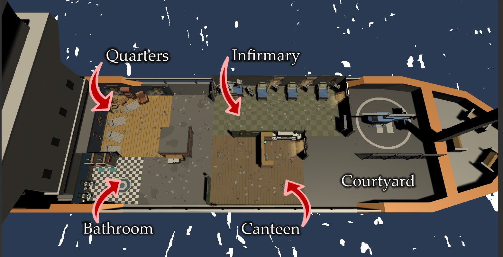
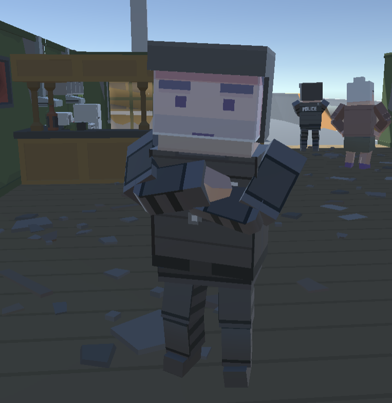
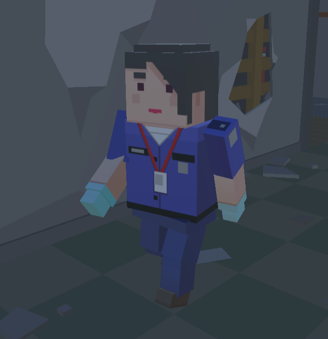

#### Important Note: This public repository just contains the final release of the game. The original repository used for its development is private because of copyright regarding the assets used.

# Mutiny!
Mutiny is a god management game where you handle the resource management of the Piolín, a ship used to transport protesters to prisons throughout the Mediterranean coast. However, the economic crisis is hitting the nation incredibly hard and everything is in short supply, so keeping your crew well sustained will be a tough task.

## Download
You can download the game by clicking this [download link](https://github.com/ch0m5/Mutiny-Release/releases/download/1.0/Mutiny.zip), which will download a zip which contains Mutiny! Extract the game and you are ready to play! Check the README in case you have any doubts on how to play the game!

## Design
Your job is to handle the supplies needed to take care of the crew: food, water, medicines, and booze are some of the resources that you will need to manage to keep them in shape. To keep earning money to sustain the crew of the ship and its prisoners, you need to keep delivering detained civilians and prisoners from one location to another, each prisoner that escapes, is a prisoner you won't be paid for.

So don't let the prisoners alone without vigilance, since they might riot or escape, in those cases, don't hesitate to deliver "proportional" violence to avoid their escape; sound the alarm!

## Main Mechanics
### 5 Game Areas

This is a picture of the Piolín ship which points out to the play areas of the game in which the characters will perform different actions.
* **Quarters:**
all characters will come here to rest and get some sleep.
* **Infirmary:**
characters who are hurt will come to this area and wait for an assistant to come and heal them.
* **Canteen:**
characters who are hungry will come to this location to eat, additionally, assistants can come here and cook to convert ingredients into edible food if they are ordered to do it.
* **Bathroom:**
characters who need to take a poop or shower will come to this location and perform their needs.

### 3 types of characters (AI Archetypes)
### Guard
Guards are responsible for maintaining order in the ship and reduce any prisoner that may escape or risk the operation.

### Assistant
Assistants are responsible have the knowledge and education to cook excellent recipes and healing all kinds of wounds, maintaining everyone at the ship healthy and avoid everyone's starvation.

### Prisoner
Protesters in detention, sentenced to jail time. They will try to escape the ship, and they might start a rally across the ship! Make sure they don't escape, so you can collect the money from transporting them to prison.

### 2 Time shifts

| Condition| Behavior|
|---|---|
|Daytime | Routine|
|Nighttime| Sneaking, Patrolling|

**_Routine_**: If a character does not have any duty that it has to perform immediately, it will try to fulfill the needs
it has. For instance, a policeman will be wandering, but decide to go to the bathroom to pee, or to go to the canteen to eat if they are hungry, because the duty they may have is not a priority.

**_Policeman & prisoner routine_**:
During the day, police and prisoners will wander around the ship and in case they need to fulfill a need they will stop wandering and fulfill a need.

**_Assistant's routine_**:
During the day, the assistant will cook if more croquettes are needed, and it will heal prisoners and police if they are hurt. In case no one needs healing or food, the assistant will wander and fulfill its needs.

**_Sneaking_**: Protesters will be more prone to try and sneak out of the ship to escape when following this behavior.

**_Patrolling_**: Police will patrol at night trying to frustrate prisoners escape plans. In order to do this, they will follow a determined path of nodes, which will cover important locations and crossings, through which the prisoners might pass on their way to escape.

### NPC Needs
* **Health**: If it reaches 0 it causes death.
* **Hunger:** Excess causes death.
* **Boredom**: Excess causes anger.
* **Energy**: Lack of it causes fainting.
* **Bladder**: Not fulfilling on time means "accident" on the spot.
* **Filth**: Excess causes health to diminish.

### Resources
* **Medicines**: To heal.
* **Ingredients**: To cook.
* **Food**: To eat.
* **Alcohol**: For boredom, expensive but locally accessible at the Canteen.
* **Tobacco**: For boredom, cheap but must be consumed far away, outside.
* **Toilet Paper**: For going to the bathroom.
* **Soap**: To use shower.

### Ship Upgrades
* **Beds**: More places to sleep (3 spots on the ground on round start).
* **Showers**: More showers (1 round start).
* **Toilets**: More toilets (1 round start).
* **Stoves**: More stoves and kitchenware (1 round start).
* **Gurneys**: More gurneys (1 round start).

## Gameplay
<iframe width="768" height="432" src="https://www.youtube.com/embed/QbXJgAy0Q8U" frameborder="0" allow="accelerometer; autoplay; encrypted-media; gyroscope; picture-in-picture" allowfullscreen></iframe>

## The team
This game was developed by Carles Homs and Dídac Romero, both enrolled in the junior year of University at UPC CITM's bachelors degree in _Video game design and development_.

* **Carles Homs:**

Github: [@ch0m5](https://github.com/ch0m5).

LinkedIn profile: [Carles Homs Puchal](https://www.linkedin.com/in/choms/).

* **Dídac Romero:**

Github: [@didacromero](https://github.com/DidacRomero).

LinkedIn profile: [Dídac Romero Camó](https://www.linkedin.com/in/d%C3%ADdac-romero-cam%C3%B3-203692166/).

## Behavior Trees

### Introduction
All agent behavior trees follow the same workflow, the different agent parameters are evaluated from highest to lowest priority: **fear**, **anger**, **player orders**, **agent needs**, **default actions**. When a parameter returns his procedure as successfully finished, the tree restarts, if it returns failed, the next priority follows until one parameter process is successful or the default actions are reached. Because of the order of priorities, player orders will be ignored by the agents if they are afraid or angry, adding chaos.

Every agent has a secondary "part" and nodes that are evaluated constantly in case there's an interruption. In such case the workflow from the "parameters" stops, nodes to evaluate the cause of the interruption are processed and any needed actions for the agent are executed, some backup procedures are done in case any important process was being done when the interruption happened then the tree restarts and will process the effects of the interruption on its regular parameter workflow.

### Note
The game uses a system of "occupied" meta-locations, and so all agents have multiple nodes where they are handled, setting locations as "occupied" and freeing them as soon as the agent starts to go somewhere else. All trees have a heavy use of method-calling to relate procedures to script parameters and other delicate data.

In this picture, we can see the part of the Prisoner's tree which evaluates a potential interruption and checks if the state of the agent has changed during its procedure. Both branches are optional, as we're just checking. This part of the tree is present in equal or very similar way in every agent.

## Prisoner

Full Tree

This branch handles if the prisoner is hit by a guard at any point, and marks the interruption if so.

The "parameter" workflow, priorities from left to right. The Needs_Tree is a workflow that is identical for every agent, so a sub-tree is used which is linked and called from every agent using its own data as parameters.

Afraid branch. While a part of the branch attempts to run to a spot and stay there for 10 seconds (left), the constantly running branch from the right interrupts the process as a failure every time the prisoner is seen by a guard.

Angry branch. On the top left, we can see that a prisoner has a 25% chance of getting angry during the night, which triggers the following workflow (can also be triggered by other means). The prisoner attempts to flee the ship, but the process is instantly interrupted when he's spotted and instantly becomes afraid. From this photo we can also see the needs branch which is the next priority and will be explained later.

Default prisoner actions. When a prisoner has nothing to do, it either wanders around or has a change of protesting. When wandering, the prisoner will join any other protesters he sees on the spot. When protesting, if he or his fellow protesters are not stopped by guards directly (hit -> faints) or indirectly (hit someone else -> afraid) they become angry and attempt to flee the ship on the next iteration of the tree (restart).

## Guard

Full Tree

Afraid and angry branches. Afraid is just to flee to a spot and wait there for a short time. Angry is to patrol around the place looking for Prisoners and Assistants until he finds one, assaults him to stop being angry (discharge).

In case of alarm, for 30 seconds go search for prisoners and assault them on sight.

Default action for guard, patrolling the map. If the guard finds prisoners protesting while patrolling, he goes up to them. If the guards can see more protesters than guards (including himself), he becomes afraid, which will make him flee in the next tree cycle. Else, if guards equal or overcome the protesters, they chose one and beat him, which makes nearby protesters flee.

## Assistant

Full Tree

The interruption loop of assistant includes becoming afraid of nearby violence, in other words, guards beating someone else who isn't the agent itself.

Afraid and angry branches. When afraid, the assistant flees to a location and waits for a while. If while waiting more violence occurs, he flees again. When angry, the assistant quits his job and goes to the escape location to leave the ship.

Assistant-related events and default action. When medical support is asked, the assistant looks for a patient location occupied and goes to the corresponding medical location if it is free. When he arrives, he heals the patient until he's fully healed, or he's left or has fainted/died.

When cooking is asked, the assistant looks for a free cooking spot and goes to cook 20 units of food or until he runs out of supplies. Finally, the default action is to wander around.

## Needs Tree
The needs tree evaluates every need of the agent and compares it to a "dynamic" threshold. Each need has a "trigger" point in which satisfying the need is wanted by the agent, however while the triggers are fixed values they are modified by the total amount of needs percentage of "completion". In other words, the higher the values of the needs are, the lower the threshold for each need becomes.

When a need is triggered, the agent goes to the designated location to satisfy it and consumes the resources needed to do so when he gets there. Once the need is fully satisfied (<= 0), he leaves. The only especial circumstance to this is to be healed. If the agent is an assistant, it goes to a medic location and heals itself fully or until he runs out of supply. If he isn't an assistant, he goes to a patient location and waits for 15 seconds. If by then he hasn't been healed, he leaves.
